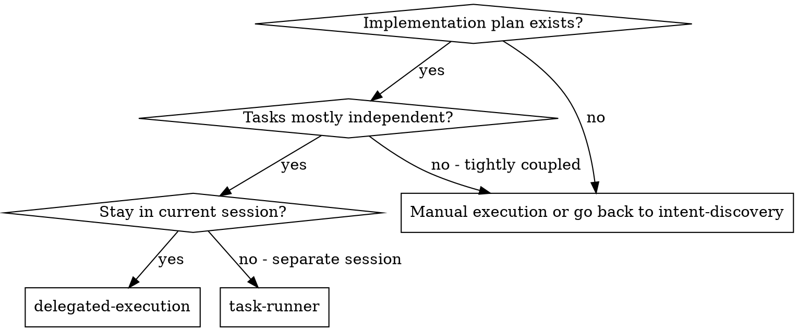
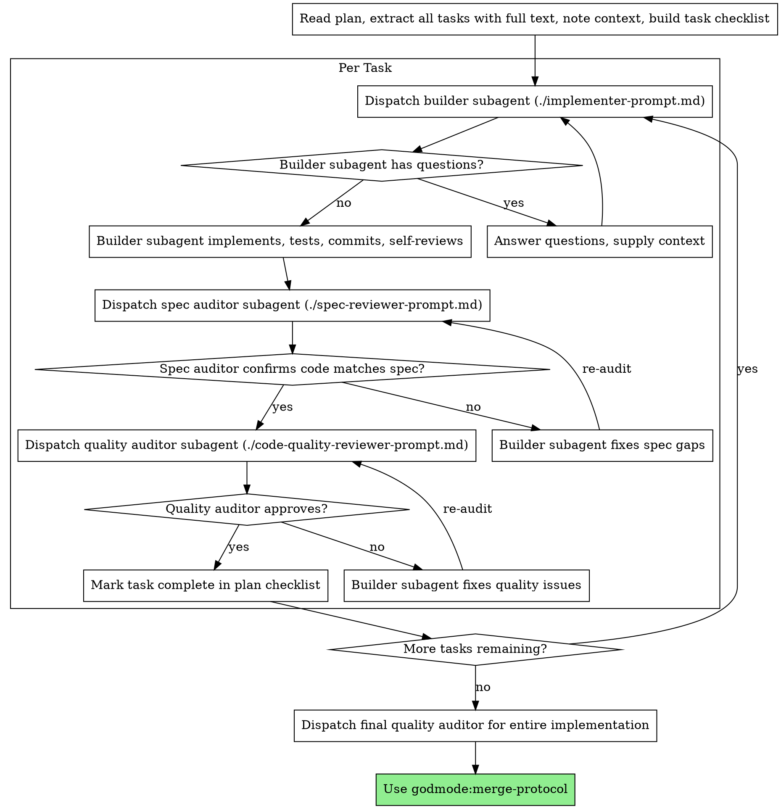

# Delegated Execution

Execute a plan by dispatching a fresh subagent per task, with two-stage review after each: specification compliance first, then code quality.

**Core principle:** Fresh subagent per task + two-stage review (spec then quality) = high quality, fast iteration

## When to Use



**vs. Task Runner (separate session):**
- Same session (no context switch)
- Fresh subagent per task (no context contamination)
- Two-stage review after each task: spec compliance first, then code quality
- Faster iteration (no human-in-loop between tasks)

## The Process



## Prompt Templates

- `./implementer-prompt.md` - Dispatch builder subagent
- `./spec-reviewer-prompt.md` - Dispatch spec compliance auditor subagent
- `./code-quality-reviewer-prompt.md` - Dispatch code quality auditor subagent

## Example Workflow

```
You: I'm using Delegated Execution to implement this plan.

[Read plan file once: docs/plans/feature-plan.md]
[Extract all 5 tasks with full text and context]
[Build task checklist from all tasks]

Task 1: Hook installation script

[Get Task 1 text and context (already extracted)]
[Dispatch builder subagent with full task text + context]

Builder: "Before I start - should the hook install at user level or system level?"

You: "User level (~/.config/godmode/hooks/)"

Builder: "Understood. Implementing now..."
[Later] Builder:
  - Implemented install-hook command
  - Added tests, 5/5 passing
  - Self-review: Noticed I missed --force flag, added it
  - Committed

[Dispatch spec compliance auditor]
Spec auditor: PASS - All requirements met, nothing extraneous

[Get git SHAs, dispatch quality auditor]
Quality auditor: Strengths: Good test coverage, clean code. Issues: None. Approved.

[Mark Task 1 complete]

Task 2: Recovery modes

[Get Task 2 text and context (already extracted)]
[Dispatch builder subagent with full task text + context]

Builder: [No questions, proceeds]
Builder:
  - Added verify/repair modes
  - 8/8 tests passing
  - Self-review: All good
  - Committed

[Dispatch spec compliance auditor]
Spec auditor: FAIL - Issues:
  - Missing: Progress reporting (spec says "report every 100 items")
  - Extra: Added --json flag (not requested)

[Builder fixes issues]
Builder: Removed --json flag, added progress reporting

[Spec auditor re-audits]
Spec auditor: PASS - Spec compliant now

[Dispatch quality auditor]
Quality auditor: Strengths: Solid. Issues (Important): Magic number (100)

[Builder fixes]
Builder: Extracted PROGRESS_INTERVAL constant

[Quality auditor re-audits]
Quality auditor: Approved

[Mark Task 2 complete]

...

[After all tasks]
[Dispatch final quality auditor]
Final auditor: All requirements met, ready to merge

Done!
```

## Advantages

**vs. Manual execution:**
- Subagents follow test-first naturally
- Fresh context per task (no confusion)
- Parallel-safe (subagents do not interfere)
- Subagent can ask questions (before AND during work)

**vs. Task Runner:**
- Same session (no handoff)
- Continuous progress (no waiting)
- Review checkpoints are automatic

**Efficiency gains:**
- No file reading overhead (controller provides full text)
- Controller curates exactly what context is needed
- Subagent receives complete information upfront
- Questions surfaced before work begins (not after)

**Quality gates:**
- Self-review catches issues before handoff
- Two-stage review: spec compliance, then code quality
- Review loops ensure fixes actually work
- Spec compliance prevents over/under-building
- Code quality ensures implementation is well-crafted

**Cost:**
- More subagent invocations (builder + 2 auditors per task)
- Controller does more preparation (extracting all tasks upfront)
- Review loops add iterations
- But catches issues early (cheaper than debugging later)

## Guardrails

**Never:**
- Start implementation on main/master branch without explicit user consent
- Skip reviews (spec compliance OR code quality)
- Proceed with unresolved issues
- Dispatch multiple builder subagents in parallel (conflicts)
- Make subagent read the plan file (provide full text instead)
- Skip scene-setting context (subagent needs to understand where the task fits)
- Ignore subagent questions (answer before letting them proceed)
- Accept "close enough" on spec compliance (auditor found issues = not done)
- Skip review loops (auditor found issues = builder fixes = audit again)
- Let builder self-review replace actual review (both are needed)
- **Start quality review before spec compliance is approved** (wrong order)
- Move to next task while either review has open issues

**If subagent asks questions:**
- Answer clearly and completely
- Provide additional context if needed
- Do not rush them into implementation

**If auditor finds issues:**
- Builder (same subagent) fixes them
- Auditor reviews again
- Repeat until approved
- Do not skip the re-audit

**If subagent fails the task:**
- Dispatch a fix subagent with specific instructions
- Do not try to fix manually (context contamination)

## Connections

**Required workflow skills:**
- **godmode:workspace-isolation** - REQUIRED: Set up isolated workspace before starting
- **godmode:task-planning** - Creates the plan this skill executes
- **godmode:quality-gate** - Code review template for auditor subagents
- **godmode:merge-protocol** - Finalize development after all tasks

**Subagents should use:**
- **godmode:test-first** - Subagents follow test-first for each task

**Alternative workflow:**
- **godmode:task-runner** - Use for separate session instead of same-session execution
