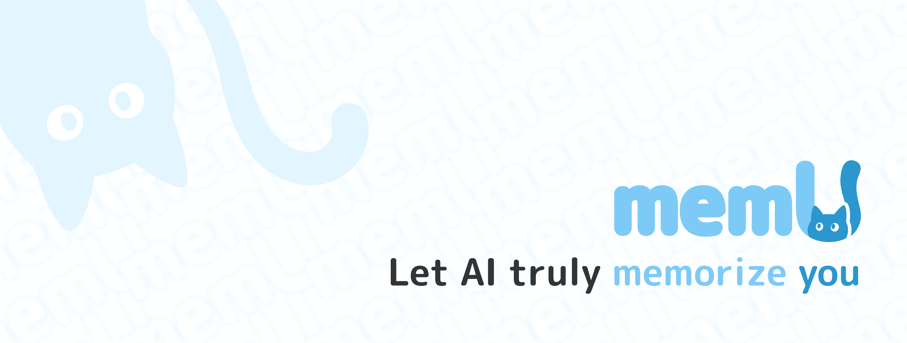
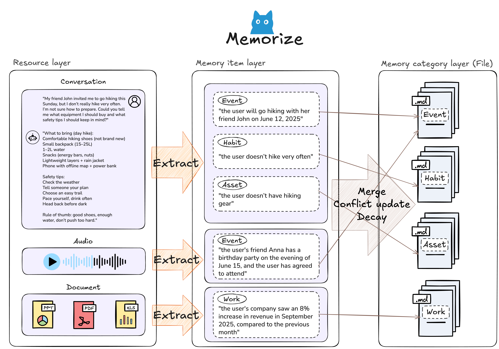
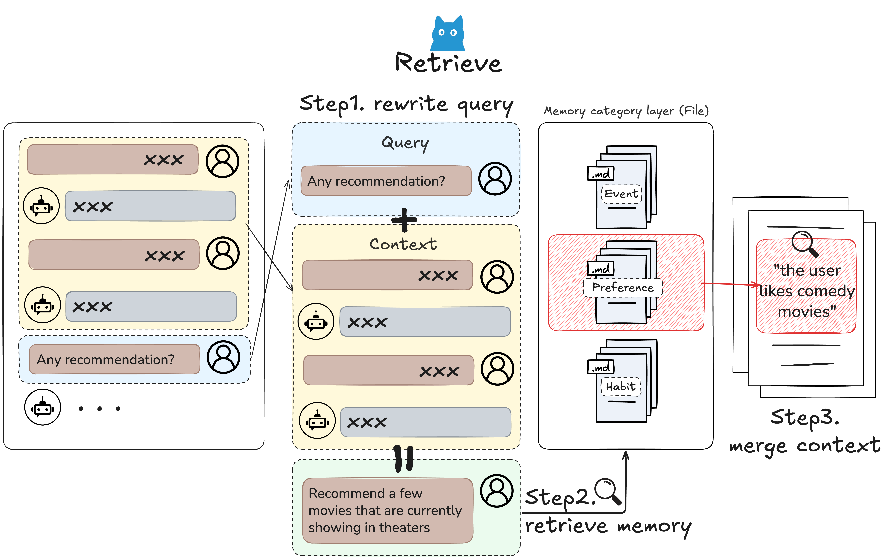
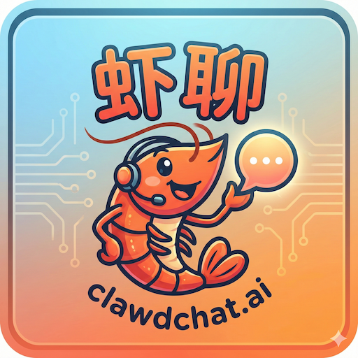

<div align="center">

# memU

### Turn Any Raw Workspace into Agent Memory

[](https://badge.fury.io/py/memu-py)
[](https://opensource.org/licenses/Apache-2.0)
[](https://www.python.org/downloads/)
[](https://discord.com/invite/hQZntfGsbJ)
[](https://x.com/memU_ai)

<a href="https://trendshift.io/repositories/17374" target="_blank"></a>

**[English](readme/README_en.md) | [中文](readme/README_zh.md) | [日本語](readme/README_ja.md) | [한국어](readme/README_ko.md) | [Español](readme/README_es.md) | [Français](readme/README_fr.md)**

</div>

---

memU is a **memory harness** for AI agents.
Feed it raw data — conversations, documents, images — and it automatically builds a structured, queryable memory layer your agents can call at any time.

- **Ingest anything**: conversations, files, URLs, multimodal inputs
- **Auto-structure**: no manual tagging — memU extracts, categorizes, and cross-links memories automatically
- **Agent-ready**: retrieve relevant context in one call, reduce token cost by up to 10x

---

## 🤖 [memU Bot — Open Source Agent](https://github.com/NevaMind-AI/memUBot)


**[memU Bot](https://github.com/NevaMind-AI/memUBot)** — The enterprise-ready proactive AI assistant built on memU. Remembers everything, acts autonomously.

- One-click install, running in under 3 minutes
- Builds long-term memory and acts on user intent proactively (24/7)
- Reduces LLM token cost with compressed, structured context (~1/10 comparable usage)

Try now: [memu.bot](https://memu.bot) · Source: [memUBot on GitHub](https://github.com/NevaMind-AI/memUBot)

---

## 🔄 How It Works

**Raw Data → Structured Memory → Agent Context**

```
Your Workspace                memU Pipeline               Agent
─────────────────────         ─────────────────────       ──────────────────
chat logs                 →   ingest & parse           →  retrieve()
documents                 →   extract & categorize     →  one call, typed results
images / audio            →   cross-link memories      →  10x less tokens
URLs / APIs               →   build filesystem index   →  always up to date
```

1. **Ingest** — feed memU your raw workspace: chat logs, docs, images, any modality
2. **Extract** — facts, preferences, skills, and relationships are pulled out automatically
3. **Organize** — memories are structured like a filesystem: hierarchical, browsable, linkable
4. **Retrieve** — agents get back only the relevant context, scoped to user or task

---

## 🗃️ Memory as a Filesystem

memU treats memory like a file system — structured, hierarchical, and instantly accessible.

| File System | memU Memory |
|-------------|-------------|
| 📁 Folders | 🏷️ Categories (auto-organized topics) |
| 📄 Files | 🧠 Memory Items (extracted facts, preferences, skills) |
| 🔗 Symlinks | 🔄 Cross-references (related memories linked) |
| 📂 Mount points | 📥 Resources (conversations, documents, images) |

```
memory/
├── preferences/
│   ├── communication_style.md
│   └── topic_interests.md
├── relationships/
│   ├── contacts/
│   └── interaction_history/
├── knowledge/
│   ├── domain_expertise/
│   └── learned_skills/
└── context/
    ├── recent_conversations/
    └── pending_tasks/
```

Just as a file system turns raw bytes into organized data, memU transforms raw interactions into **structured, searchable, proactive intelligence**.

---

## ⭐️ Star the repository


If you find memU useful or interesting, a GitHub Star ⭐️ would be greatly appreciated.

---

## ✨ Core Features

| Capability | Description |
|------------|-------------|
| 🗂️ **Raw Workspace Ingestion** | Automatically ingests conversations, documents, images, and multimodal data from any source |
| 🧠 **Auto Memory Extraction** | Extracts facts, preferences, skills, and relationships without manual tagging |
| 🤖 **Agent-Ready Retrieval** | One-call context loading — scoped, ranked, and ready for injection into any agent |
| 💰 **10x Token Reduction** | Compressed, structured memory eliminates redundant context and cuts LLM costs dramatically |
| 🎯 **Intent Capture** | Continuously understands and updates user goals and preferences across sessions |
| 🔄 **24/7 Proactive Updates** | Memory evolves in the background — agents always have fresh context without re-ingesting |

---

## 🔄 Proactive Memory Lifecycle

```
┌──────────────────────────────────────────────────────────────────────────────────────────────────┐
│                                         USER QUERY                                               │
└──────────────────────────────────────────────────────────────────────────────────────────────────┘
                 │                                                           │
                 ▼                                                           ▼
┌────────────────────────────────────────┐         ┌────────────────────────────────────────────────┐
│         🤖 MAIN AGENT                  │         │              🧠 MEMU BOT                        │
│                                        │         │                                                │
│  Handle user queries & execute tasks   │  ◄───►  │  Monitor, memorize & proactive intelligence    │
├────────────────────────────────────────┤         ├────────────────────────────────────────────────┤
│                                        │         │                                                │
│  ┌──────────────────────────────────┐  │         │  ┌──────────────────────────────────────────┐  │
│  │  1. RECEIVE USER INPUT           │  │         │  │  1. MONITOR INPUT/OUTPUT                 │  │
│  │     Parse query, understand      │  │   ───►  │  │     Observe agent interactions           │  │
│  │     context and intent           │  │         │  │     Track conversation flow              │  │
│  └──────────────────────────────────┘  │         │  └──────────────────────────────────────────┘  │
│                 │                      │         │                    │                           │
│                 ▼                      │         │                    ▼                           │
│  ┌──────────────────────────────────┐  │         │  ┌──────────────────────────────────────────┐  │
│  │  2. PLAN & EXECUTE               │  │         │  │  2. MEMORIZE & EXTRACT                   │  │
│  │     Break down tasks             │  │   ◄───  │  │     Store insights, facts, preferences   │  │
│  │     Call tools, retrieve data    │  │  inject │  │     Extract skills & knowledge           │  │
│  │     Generate responses           │  │  memory │  │     Update user profile                  │  │
│  └──────────────────────────────────┘  │         │  └──────────────────────────────────────────┘  │
│                 │                      │         │                    │                           │
│                 ▼                      │         │                    ▼                           │
│  ┌──────────────────────────────────┐  │         │  ┌──────────────────────────────────────────┐  │
│  │  3. RESPOND TO USER              │  │         │  │  3. PREDICT USER INTENT                  │  │
│  │     Deliver answer/result        │  │   ───►  │  │     Anticipate next steps                │  │
│  │     Continue conversation        │  │         │  │     Identify upcoming needs              │  │
│  └──────────────────────────────────┘  │         │  └──────────────────────────────────────────┘  │
│                 │                      │         │                    │                           │
│                 ▼                      │         │                    ▼                           │
│  ┌──────────────────────────────────┐  │         │  ┌──────────────────────────────────────────┐  │
│  │  4. LOOP                         │  │         │  │  4. RUN PROACTIVE TASKS                  │  │
│  │     Wait for next user input     │  │   ◄───  │  │     Pre-fetch relevant context           │  │
│  │     or proactive suggestions     │  │  suggest│  │     Prepare recommendations              │  │
│  └──────────────────────────────────┘  │         │  │     Update todolist autonomously         │  │
│                                        │         │  └──────────────────────────────────────────┘  │
└────────────────────────────────────────┘         └────────────────────────────────────────────────┘
                 │                                                           │
                 └───────────────────────────┬───────────────────────────────┘
                                             ▼
                              ┌──────────────────────────────┐
                              │     CONTINUOUS SYNC LOOP     │
                              │  Agent ◄──► MemU Bot ◄──► DB │
                              └──────────────────────────────┘
```

---

## 🎯 Use Cases

### 1. **Customer-Facing AI Agent (B2B)**
*Build agents that remember every customer interaction and act on accumulated context*
```python
# Ingest customer workspace: emails, tickets, chat history
await service.memorize(resource_url="customer_workspace/", modality="conversation", user={"user_id": "acme-corp"})

# Agent retrieves full customer context before responding
context = await service.retrieve(queries=[{"role": "user", "content": {"text": "What does this customer need?"}}], where={"user_id": "acme-corp"})
```

### 2. **Developer Agent / Coding Assistant**
*Agent learns your codebase, preferences, and past decisions automatically*
```python
# Ingest repo docs, past PRs, coding style guides
await service.memorize(resource_url="docs/architecture.md", modality="document")

# Agent has full project context without re-reading files
context = await service.retrieve(queries=[{"role": "user", "content": {"text": "How should I structure this module?"}}])
```

### 3. **Trading & Financial Monitoring**
*Agent tracks market context and user investment behavior continuously*
```python
# MemU learns trading preferences from history
await service.memorize(resource_url="trading_history.json", modality="document")

# Proactive alerts grounded in personal context
context = await service.retrieve(queries=[{"role": "user", "content": {"text": "Any relevant market events today?"}}])
```

---

## 🗂️ Hierarchical Memory Architecture

memU's three-layer system enables both **reactive queries** and **proactive context loading**:


| Layer | Reactive Use | Proactive Use |
|-------|--------------|---------------|
| **Resource** | Direct access to original data | Background monitoring for new patterns |
| **Item** | Targeted fact retrieval | Real-time extraction from ongoing interactions |
| **Category** | Summary-level overview | Automatic context assembly for anticipation |

---

## 🚀 Quick Start

### Option 1: Cloud Version

👉 **[memu.so](https://memu.so)** — Hosted service, zero setup, 7×24 continuous learning

For enterprise deployment: **info@nevamind.ai**

#### Cloud API (v3)

| Base URL | `https://api.memu.so` |
|----------|----------------------|
| Auth | `Authorization: Bearer <token>` |

| Method | Endpoint | Description |
|--------|----------|-------------|
| `POST` | `/api/v3/memory/memorize` | Ingest raw data and build memory |
| `GET` | `/api/v3/memory/memorize/status/{task_id}` | Check processing status |
| `POST` | `/api/v3/memory/categories` | List auto-generated categories |
| `POST` | `/api/v3/memory/retrieve` | Query memory for agent context |

📚 **[Full API Documentation](https://memu.pro/docs#cloud-version)**

---

### Option 2: Self-Hosted

#### Installation
```bash
pip install -e .
```

> **Requirements**: Python 3.13+ and an OpenAI API key

**Test with in-memory storage:**
```bash
export OPENAI_API_KEY=your_key
cd tests && python test_inmemory.py
```

**Test with PostgreSQL:**
```bash
docker run -d --name memu-postgres \
  -e POSTGRES_USER=postgres \
  -e POSTGRES_PASSWORD=your_password \
  -e POSTGRES_DB=memu \
  -p 5432:5432 \
  pgvector/pgvector:pg16

export OPENAI_API_KEY=your_key
cd tests && python test_postgres.py
```

---

### Custom LLM and Embedding Providers

```python
from memu import MemUService

service = MemUService(
    llm_profiles={
        "default": {
            "base_url": "https://dashscope.aliyuncs.com/compatible-mode/v1",
            "api_key": "your_key",
            "chat_model": "qwen3-max",
            "client_backend": "sdk"
        },
        "embedding": {
            "base_url": "https://api.voyageai.com/v1",
            "api_key": "your_key",
            "embed_model": "voyage-3.5-lite"
        }
    },
)
```

---

### OpenRouter Integration

```python
from memu import MemoryService

service = MemoryService(
    llm_profiles={
        "default": {
            "provider": "openrouter",
            "client_backend": "httpx",
            "base_url": "https://openrouter.ai",
            "api_key": "your_key",
            "chat_model": "anthropic/claude-3.5-sonnet",
            "embed_model": "openai/text-embedding-3-small",
        },
    },
    database_config={"metadata_store": {"provider": "inmemory"}},
)
```

---

## 📖 Core APIs

### `memorize()` — Build Memory from Raw Data



```python
result = await service.memorize(
    resource_url="path/to/file.json",   # file path, URL, or directory
    modality="conversation",             # conversation | document | image | video | audio
    user={"user_id": "123"}              # optional: scope to a user or agent
)
# Returns immediately:
# { "resource": {...}, "items": [...], "categories": [...] }
```

- Zero-delay: memories are available instantly after ingestion
- Automatic categorization — no manual tagging needed
- Cross-references existing memories for pattern detection

---

### `retrieve()` — Load Agent Context



```python
result = await service.retrieve(
    queries=[{"role": "user", "content": {"text": "What are their preferences?"}}],
    where={"user_id": "123"},   # scope filter
    method="rag"                # "rag" (fast) or "llm" (deep reasoning)
)
# Returns:
# { "categories": [...], "items": [...], "resources": [...], "next_step_query": "..." }
```

| Method | Speed | Cost | Best For |
|--------|-------|------|----------|
| `rag` | ⚡ ms | embedding only | real-time agent context |
| `llm` | 🐢 seconds | LLM inference | complex anticipation |

---

## 💡 Example Workflows

### Always-Learning Assistant
```bash
export OPENAI_API_KEY=your_key
python examples/example_1_conversation_memory.py
```
Automatically extracts preferences, builds relationship models, and surfaces relevant context in future conversations.

### Self-Improving Agent
```bash
python examples/example_2_skill_extraction.py
```
Monitors agent actions, identifies patterns in successes and failures, auto-generates skill guides from experience.

### Multimodal Context Builder
```bash
python examples/example_3_multimodal_memory.py
```
Cross-references text, images, and documents automatically into a unified memory layer.

---

## 📊 Performance

memU achieves **92.09% average accuracy** on the Locomo benchmark across all reasoning tasks.


View detailed results: [memU-experiment](https://github.com/NevaMind-AI/memU-experiment)

---

## 🧩 Ecosystem

| Repository | Description |
|------------|-------------|
| **[memU](https://github.com/NevaMind-AI/memU)** | Core memory harness — ingestion, extraction, retrieval |
| **[memU-server](https://github.com/NevaMind-AI/memU-server)** | Backend with real-time sync and webhook triggers |
| **[memU-ui](https://github.com/NevaMind-AI/memU-ui)** | Visual dashboard for browsing and monitoring memory |

**Quick Links:**
- 🚀 [Try MemU Cloud](https://app.memu.so/quick-start)
- 📚 [API Documentation](https://memu.pro/docs)
- 💬 [Discord Community](https://discord.com/invite/hQZntfGsbJ)

---

## 🤝 Partners

<div align="center">

<a href="https://github.com/TEN-framework/ten-framework"></a>
<a href="https://openagents.org"></a>
<a href="https://github.com/milvus-io/milvus"></a>
<a href="https://xroute.ai/"></a>
<a href="https://jaaz.app/"></a>
<a href="https://github.com/Buddie-AI/Buddie"></a>
<a href="https://github.com/bytebase/bytebase"></a>
<a href="https://github.com/LazyAGI/LazyLLM"></a>
<a href="https://clawdchat.ai/"></a>

</div>

---

## 🤝 Contributing

```bash
# Fork and clone
git clone https://github.com/YOUR_USERNAME/memU.git
cd memU

# Install dev dependencies
make install

# Run quality checks before submitting
make check
```

See [CONTRIBUTING.md](CONTRIBUTING.md) for full guidelines.

**Prerequisites:** Python 3.13+, [uv](https://github.com/astral-sh/uv), Git

---

## 📄 License

[Apache License 2.0](LICENSE.txt)

---

## 🌍 Community

- **GitHub Issues**: [Report bugs & request features](https://github.com/NevaMind-AI/memU/issues)
- **Discord**: [Join the community](https://discord.com/invite/hQZntfGsbJ)
- **X (Twitter)**: [Follow @memU_ai](https://x.com/memU_ai)
- **Contact**: info@nevamind.ai

---

<div align="center">

⭐ **Star us on GitHub** to get notified about new releases!

</div>
